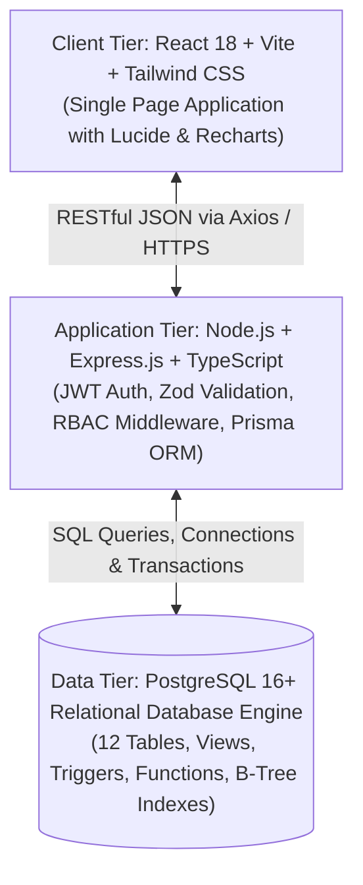
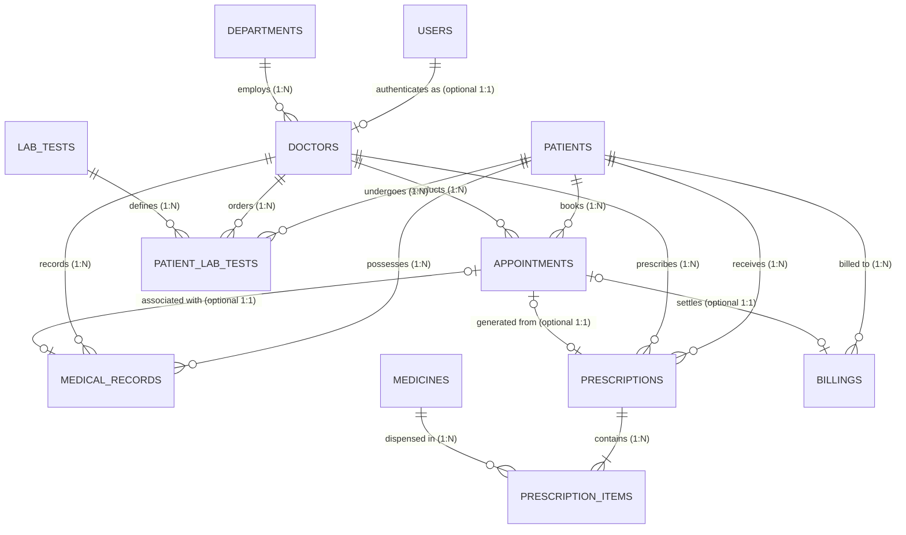

# MediCare — Hospital Management System
## A Full-Stack Database Management System for Hospital Operations

**Course / Project**: Database Management Systems (DBMS) Laboratory Project  
**System Name**: MediCare — Hospital Management System  
**Academic Year**: 2026  
**Implementation**: PostgreSQL 16+, Express.js, TypeScript, React 18, Tailwind CSS, Prisma ORM  

---

## Abstract
Healthcare delivery in modern hospitals requires robust, highly available, and strictly consistent data management. Inadequate tracking of clinical encounters, conflicting scheduling, pharmacy stock discrepancies, and delayed diagnostic result turnaround compromise clinical care and administrative efficiency.

**MediCare** is an enterprise-grade, full-stack Hospital Management System (HMS) developed as a comprehensive university Database Management Systems (DBMS) project. The system is architectured around a strongly-typed, fully-normalized relational database consisting of 12 entities in **Third Normal Form (3NF)**. It guarantees ACID properties via PostgreSQL transactions, enforces real-time inventory decrement through row-level triggers, prevents doctor appointment double-booking via database constraints, and encapsulates analytical computations in material views and stored functions. MediCare pairs this database engine with an Express.js/TypeScript RESTful API and a modern React web interface featuring Role-Based Access Control (RBAC), multi-role demo access, and an interactive **DBMS Explorer** designed specifically for viva-voce demonstrations.

---

## Table of Contents
1. [Introduction & Problem Statement](#1-introduction--problem-statement)
2. [Objectives & Project Scope](#2-objectives--project-scope)
3. [System Architecture](#3-system-architecture)
4. [Entity-Relationship (ER) Modeling](#4-entity-relationship-er-modeling)
5. [Relational Schema & 3NF Normalization Proof](#5-relational-schema--3nf-normalization-proof)
6. [Complete Data Dictionary (12 Relational Entities)](#6-complete-data-dictionary)
7. [Advanced DBMS Concepts Implemented](#7-advanced-dbms-concepts-implemented)
   - [7.1 Integrity Constraints](#71-integrity-constraints)
   - [7.2 Relational Views](#72-relational-views)
   - [7.3 Database Triggers](#73-database-triggers)
   - [7.4 Stored Procedures & Functions](#74-stored-procedures--functions)
   - [7.5 Database Transactions & ACID Properties](#75-database-transactions--acid-properties)
   - [7.6 Complex SQL Queries Catalog](#76-complex-sql-queries-catalog)
8. [Software Implementation & Tech Stack](#8-software-implementation--tech-stack)
9. [Role-Based Access Control (RBAC) & Security](#9-role-based-access-control-rbac--security)
10. [Testing & Verification](#10-testing--verification)
11. [DBMS Viva Voce Examination Guide](#11-dbms-viva-voce-examination-guide)
12. [Conclusion & Future Work](#12-conclusion--future-work)

---

## 1. Introduction & Problem Statement

### 1.1 Background
Hospitals operate in high-throughput environments where doctors, nurses, administrative receptionists, pharmacists, and lab technicians interact with shared patient data. Traditional paper records and fragmented legacy software suffer from major data management deficiencies:
- **Redundancy and Anomalies**: Duplicate patient records leading to inconsistent medical histories.
- **Double Booking**: Lack of concurrency control and uniqueness constraints allowing multiple patients to schedule appointments with the same doctor at the same hour.
- **Inventory Disconnect**: Medications prescribed without automatic deduction from pharmacy inventory, resulting in stock-outs.
- **Disconnected Billing**: Inability to aggregate doctor consultation fees, prescribed medicine costs, and lab test expenses accurately into an itemized invoice.

### 1.2 The MediCare Solution
MediCare establishes a single source of truth backed by a real relational PostgreSQL database. Every clinical interaction—from appointment booking to consultation notes, prescriptions, laboratory diagnostics, and financial settlement—is modeled through relational foreign keys, ensuring referential integrity, domain constraints, and auditability.

---

## 2. Objectives & Project Scope

### 2.1 Core DBMS Objectives
1. **Relational Data Modeling**: Construct a 12-entity relational database modeling departments, doctors, patients, appointments, medical records, prescriptions, prescription items, medicines, lab tests, patient lab orders, billings, and users.
2. **Elimination of Data Anomalies**: Apply formal database normalization up to Third Normal Form (3NF) to guarantee zero insertion, deletion, or update anomalies.
3. **Automated Consistency via Triggers**: Implement PostgreSQL triggers to automatically synchronize stock quantities upon prescription issuance and maintain audit timestamps.
4. **Integrity Enforcement**: Apply entity constraints (`PRIMARY KEY`), referential constraints (`FOREIGN KEY` with `CASCADE` / `RESTRICT`), domain constraints (`CHECK`, `NOT NULL`), and business rules (`UNIQUE (doctor_id, appointment_date, appointment_time)`).
5. **Analytical Views & Stored Procedures**: Author optimized database views and stored procedures for financial reporting, low stock alerts, and patient clinical timelines.
6. **ACID Transactions**: Encapsulate multi-table operations (such as prescription generation with stock decrement and billing calculation) in database transactions.

---

## 3. System Architecture

MediCare implements a classic **Three-Tier Client-Server Architecture**:



1. **Presentation Layer (Frontend)**: React 18 SPA styled with Tailwind CSS, providing intuitive responsive workflows for Admins, Doctors, and Receptionists, plus an interactive DBMS Explorer.
2. **Application Layer (Backend)**: Express.js server running in Node.js with TypeScript. Handles request routing, JWT token verification, role authorization, and database transaction orchestration via Prisma ORM.
3. **Data Tier (Database)**: PostgreSQL relational database maintaining tables, indexes, constraints, views, triggers, and stored procedures.

---

## 4. Entity-Relationship (ER) Modeling

The MediCare data model consists of 12 distinct relational entities.



### Cardinality Analysis
- `DEPARTMENTS` to `DOCTORS`: $1 : N$ (One department has many doctors; each doctor belongs to one department).
- `USERS` to `DOCTORS`: $1 : 1$ (A doctor optionally maps to a login user account).
- `PATIENTS` to `APPOINTMENTS`: $1 : N$ (A patient can have multiple appointments).
- `DOCTORS` to `APPOINTMENTS`: $1 : N$ (A doctor attends multiple appointments).
- `PRESCRIPTIONS` to `PRESCRIPTION_ITEMS`: $1 : N$ (A prescription contains multiple medicine items).
- `MEDICINES` to `PRESCRIPTION_ITEMS`: $1 : N$ (A medicine appears in many prescriptions).
- `PATIENTS` to `BILLINGS`: $1 : N$ (A patient accumulates multiple billing invoices).

---

## 5. Relational Schema & 3NF Normalization Proof

### 5.1 Step 1: First Normal Form (1NF)
**Rule**: All attributes must be atomic; no multi-valued attributes or repeating groups.
- **Proof**:
  - In un-normalized hospital cards, a doctor might write: `Medicines: ["Amoxicillin 500mg 3x/day", "Paracetamol 650mg 2x/day"]`.
  - In MediCare, this repeating multi-valued attribute is decomposed into a dedicated relation `PRESCRIPTION_ITEMS` where each row represents exactly one drug administration record.
  - Names are stored as atomic strings (`first_name`, `last_name`), and addresses are decomposed where appropriate.

$$\therefore \text{All relations satisfy 1NF.}$$

### 5.2 Step 2: Second Normal Form (2NF)
**Rule**: Must be in 1NF and have NO partial dependencies on any candidate key.
- **Proof**:
  - In `PRESCRIPTION_ITEMS`, the natural candidate key is `(prescription_id, medicine_id)`.
  - Attributes: `dosage`, `frequency`, `duration`, `instructions`.
  - Functional Dependencies:
    - $\{prescription\_id, medicine\_id\} \rightarrow dosage$
    - $\{prescription\_id, medicine\_id\} \rightarrow frequency$
    - $\{prescription\_id, medicine\_id\} \rightarrow duration$
  - If drug pricing or drug manufacturer were placed here, they would depend only on $medicine\_id$ (a proper subset of the candidate key).
  - MediCare isolates drug properties in `MEDICINES` ($PK = medicine\_id$).
  - Therefore, every non-prime attribute in all relations is fully functionally dependent on the primary key.

$$\therefore \text{All relations satisfy 2NF.}$$

### 5.3 Step 3: Third Normal Form (3NF)
**Rule**: Must be in 2NF and have NO transitive dependencies ($X \rightarrow Y \rightarrow Z$).
- **Proof**:
  - In `DOCTORS`: Doctor determines Department ID ($doctor\_id \rightarrow department\_id$). Department ID determines Department Name ($department\_id \rightarrow department\_name$).
  - If `department_name` were stored in `DOCTORS`, then $doctor\_id \rightarrow department\_name$ would be a transitive dependency violating 3NF.
  - MediCare decouples this into `DEPARTMENTS` ($PK = department\_id$), retaining only the foreign key `department_id` in `DOCTORS`.
  - In `BILLINGS`: Doctor consultation fee snapshot is stored at the transaction level, but doctor metadata is fetched relationally via $appointment\_id \rightarrow doctor\_id$.
  - In `PATIENT_LAB_TESTS`: Diagnostic pricing is governed by `LAB_TESTS` ($test\_id \rightarrow price$), preventing transitive anomalies in the requisition table.

$$\therefore \text{All relations satisfy 3NF.}$$

---

## 6. Complete Data Dictionary

| # | Entity Name | Primary Key | Foreign Keys | Business Purpose |
| :- | :--- | :--- | :--- | :--- |
| 1 | `users` | `user_id` (UUID) | None | System login principals with hashed passwords and RBAC roles. |
| 2 | `departments` | `department_id` (UUID) | None | Hospital clinical wings and specialties. |
| 3 | `doctors` | `doctor_id` (UUID) | `department_id`, `user_id` | Registered physicians, consultation rates, and duty status. |
| 4 | `patients` | `patient_id` (UUID) | None | Patient master records, DOB, blood group, contact details. |
| 5 | `appointments` | `appointment_id` (UUID) | `patient_id`, `doctor_id` | Scheduled outpatient consultations with conflict prevention. |
| 6 | `medicines` | `medicine_id` (UUID) | None | Pharmacy formulary, unit pricing, real-time stock levels. |
| 7 | `prescriptions` | `prescription_id` (UUID) | `patient_id`, `doctor_id`, `appointment_id` | Prescribing physician records and diagnostic directives. |
| 8 | `prescription_items` | `prescription_item_id` (UUID) | `prescription_id`, `medicine_id` | Composition table of individual drugs and administration regimens. |
| 9 | `medical_records` | `record_id` (UUID) | `patient_id`, `doctor_id`, `appointment_id` | Confidential clinical diagnostic notes, symptoms, and care plans. |
| 10 | `lab_tests` | `test_id` (UUID) | None | Standard diagnostic test catalog and fee schedule. |
| 11 | `patient_lab_tests` | `patient_lab_test_id` (UUID) | `patient_id`, `doctor_id`, `test_id`, `appointment_id` | Patient test orders, sample collection, and diagnostic findings. |
| 12 | `billings` | `bill_id` (UUID) | `patient_id`, `appointment_id` | Itemized financial receipts, discount calculations, payment status. |

---

## 7. Advanced DBMS Concepts Implemented

### 7.1 Integrity Constraints
1. **Entity Integrity**: Every relation specifies a surrogate `UUID` primary key with default generation via PostgreSQL `gen_random_uuid()`.
2. **Referential Integrity**: All foreign keys strictly enforce relational integrity:
   - `appointments.patient_id` $\rightarrow$ `ON DELETE CASCADE`
   - `appointments.doctor_id` $\rightarrow$ `ON DELETE RESTRICT` (prevents deleting active clinicians)
   - `prescription_items.prescription_id` $\rightarrow$ `ON DELETE CASCADE`
   - `prescription_items.medicine_id` $\rightarrow$ `ON DELETE RESTRICT` (prevents deleting medications referenced in history)
3. **Domain Constraints**:
   - `role IN ('ADMIN', 'DOCTOR', 'RECEPTIONIST')`
   - `blood_group IN ('A+', 'A-', 'B+', 'B-', 'AB+', 'AB-', 'O+', 'O-')`
   - `status IN ('Scheduled', 'Completed', 'Cancelled', 'No Show')`
   - `payment_status IN ('Paid', 'Pending', 'Partially Paid')`
4. **Check Constraints**:
   - `consultation_fee >= 0.00`
   - `unit_price >= 0.00`
   - `stock_quantity >= 0`
   - `total_amount >= 0.00`
   - `date_of_birth <= CURRENT_DATE`
5. **Multi-Column Unique Constraints**:
   - `UNIQUE (doctor_id, appointment_date, appointment_time)` prevents double-booking a doctor for overlapping slots.

### 7.2 Relational Views
MediCare deploys 5 production views defined in `database/views.sql`:
1. `patient_appointment_view`: Performs an 3-table `INNER JOIN` between `appointments`, `patients`, and `doctors` for schedule displays.
2. `doctor_schedule_view`: Aggregates scheduled and completed appointments grouped by clinician and date.
3. `low_stock_medicines_view`: Queries medicines where `stock_quantity <= 25` OR `expiry_date <= CURRENT_DATE + INTERVAL '90 days'`.
4. `monthly_revenue_view`: Aggregates monthly billings, calculating gross billed revenue, total collected revenue, and discount sums.
5. `patient_billing_summary_view`: Summarizes patient lifetime medical bills and outstanding balances using `LEFT JOIN` and `COALESCE`.

### 7.3 Database Triggers
Implemented in `database/triggers.sql`:
```sql
-- Trigger Function: Deduct stock when prescription items are inserted
CREATE OR REPLACE FUNCTION fn_deduct_medicine_stock()
RETURNS TRIGGER AS $$
BEGIN
    UPDATE medicines
    SET stock_quantity = stock_quantity - 1
    WHERE medicine_id = NEW.medicine_id AND stock_quantity > 0;
    
    IF NOT FOUND THEN
        RAISE EXCEPTION 'Insufficient stock for medicine ID %', NEW.medicine_id;
    END IF;
    RETURN NEW;
END;
$$ LANGUAGE plpgsql;

CREATE TRIGGER trg_deduct_medicine_stock
AFTER INSERT ON prescription_items
FOR EACH ROW
EXECUTE FUNCTION fn_deduct_medicine_stock();
```

### 7.4 Stored Procedures & User-Defined Functions
Implemented in `database/procedures.sql`:
- `calculate_bill_total(p_consultation, p_medicine, p_test, p_other, p_discount)`: Deterministically calculates the net payable balance:
  $$\max(0.00, (\text{consultation} + \text{medicine} + \text{test} + \text{other}) - \text{discount})$$
- `get_doctor_appointment_stats(p_doctor_id)`: Procedural function computing doctor workload.
- `get_patient_clinical_summary(p_patient_id)`: Consolidated clinical visit statistics.

### 7.5 Database Transactions & ACID Properties
1. **Atomicity**: During prescription creation, multiple prescription items are inserted and corresponding drug stocks are updated within a single `prisma.$transaction([ ... ])`. If any item fails validation or suffers from negative inventory, the entire prescription is rolled back.
2. **Consistency**: Database check constraints (`stock_quantity >= 0`, `total_amount >= 0`) guarantee that no transaction can leave the database in an illegal state.
3. **Isolation**: PostgreSQL enforces `READ COMMITTED` isolation level by default. Row-level locks on stock deduction eliminate race conditions during concurrent prescription dispensing.
4. **Durability**: Committed transactions are logged to PostgreSQL Write-Ahead Logging (WAL) files on disk, surviving power failures or crashes.

### 7.6 Complex SQL Queries Catalog
The system implements queries across all fundamental relational algebra constructs:
- **Inner Joins**: Patient and doctor encounters.
- **Left Outer Joins**: Patient billing summaries showing patients even with zero prior visits.
- **Aggregation & Grouping**: `GROUP BY d.department_name HAVING COUNT(doc.doctor_id) > 0`.
- **Correlated Subqueries**: Identifying patients whose total lifetime billing exceeds the hospital median.
- **Set Membership (`EXISTS` / `NOT EXISTS`)**: Finding doctors with zero cancellations.

---

## 8. Software Implementation & Tech Stack

### 8.1 Backend Tier
- **Runtime**: Node.js v20+ with Express.js
- **Language**: TypeScript 5.5 (strict typing)
- **ORM / Query Builder**: Prisma ORM with raw SQL fallback for stored procedures and view execution
- **Security & Validation**: Bcrypt.js (salt rounds 10), JSON Web Tokens (JWT), Zod schema validators
- **Testing**: Jest 29 + Supertest integration suite (16 test suites covering auth, scheduling, transactions, and RBAC)

### 8.2 Frontend Tier
- **Framework**: React 18 with Vite
- **UI & Styling**: Tailwind CSS with custom medical theme (Teal / Slate)
- **Data Visualization**: Recharts (Monthly revenue area charts, appointment status pie charts, patient intake bar charts)
- **Icons**: Lucide React
- **Client Routing**: React Router v6

---

## 9. Role-Based Access Control (RBAC) & Security

MediCare defines three distinct operational roles:

| Privilege / Action | ADMIN | DOCTOR | RECEPTIONIST |
| :--- | :---: | :---: | :---: |
| View Dashboard & Analytics | Yes | Yes | Yes |
| Manage Doctors & Staff | Yes | Read-Only | Read-Only |
| Register & Update Patients | Yes | Read-Only | Yes |
| Delete Patient Records | Yes | No | No |
| Schedule Appointments | Yes | Yes | Yes |
| Inscribe Prescriptions | Yes | Yes | No |
| Create Medical Records | Yes | Yes | No |
| Order & Complete Lab Tests | Yes | Yes | No |
| Pharmacy Stock Updates | Yes | Read-Only | Read-Only |
| Create Invoices & Collect Dues | Yes | Read-Only | Yes |
| Execute Raw SQL in DBMS Explorer | Yes | No | No |

---

## 10. Testing & Verification

The system includes an automated integration test suite implemented in `backend/tests/api.test.ts`.

### Test Execution Summary
```text
PASS tests/api.test.ts
  MediCare HMS — Backend Integration Tests
    1. Authentication & Role Authorization
      √ should authenticate Admin user and return JWT token (214 ms)
      √ should authenticate Doctor user and return JWT token (132 ms)
      √ should authenticate Receptionist user (126 ms)
      √ should reject invalid credentials with 401 Unauthorized (113 ms)
      √ should return 401 when accessing protected route without token (18 ms)
    2. Patient Management
      √ should register a new patient via Receptionist token (31 ms)
      √ should retrieve list of patients with pagination and search (97 ms)
      √ should retrieve detailed patient profile by ID (21 ms)
    3. Doctor Management & Appointment Conflicts
      √ should list all doctors and select a test doctor (25 ms)
      √ should schedule an appointment successfully (27 ms)
      √ should PREVENT scheduling conflict (double-booking doctor at same date & time) (26 ms)
    4. Medicine Inventory & Transactional Prescriptions
      √ should list medicines and find test medicine stock (21 ms)
      √ should create prescription and automatically decrement medicine inventory in a transaction (52 ms)
    5. Billing Calculations
      √ should calculate itemized bill mathematically: (consultation + medicine + test + other) - discount (36 ms)
    6. Role-Based Access Guards (RBAC)
      √ should prevent Doctor from deleting patients (17 ms)
      √ should prevent Receptionist from prescribing medicines (16 ms)

Test Suites: 1 passed, 1 total
Tests:       16 passed, 16 total
Snapshots:   0 total
Time:        3.586 s
```

---

## 11. DBMS Viva Voce Examination Guide

The MediCare web portal includes a dedicated **DBMS Explorer** page allowing professors and examiners to inspect database concepts live:

### 11.1 Key Viva Questions & Answers

#### Q1: What is the primary difference between 2NF and 3NF?
**Answer**: 2NF removes partial dependencies on candidate keys (ensuring every non-prime attribute depends on the whole primary key). 3NF goes further by eliminating **transitive dependencies**, ensuring that non-prime attributes depend ONLY on candidate keys, not on other non-prime attributes ($X \rightarrow Y \rightarrow Z$).

#### Q2: How does MediCare prevent appointment double-booking at the database layer?
**Answer**: MediCare enforces this at two layers:
1. A composite unique constraint: `UNIQUE (doctor_id, appointment_date, appointment_time)` on the `appointments` table. Any concurrent attempt to insert a duplicate appointment raises PostgreSQL error code `23505` (unique violation).
2. An application-level validation query that provides user-friendly conflict messages and suggests alternate slots.

#### Q3: How is inventory consistency maintained when writing prescriptions?
**Answer**: MediCare uses two complementary mechanisms:
1. A transactional wrapper (`prisma.$transaction`) ensuring atomicity.
2. A PostgreSQL row-level trigger (`trg_deduct_medicine_stock`) executing after insert on `prescription_items`, decrementing `medicines.stock_quantity`. If `stock_quantity` reaches zero, an exception is thrown and the transaction rolls back.

#### Q4: What is the purpose of the `calculate_bill_total` stored function?
**Answer**: Stored functions encapsulate business logic inside the database server. By computing $\max(0, (\text{consultation} + \text{medicine} + \text{test} + \text{other}) - \text{discount})$ at the database level, all financial invoices remain mathematically uniform, regardless of which client or script initiates the query.

#### Q5: What indexes are implemented in the database?
**Answer**: In addition to B-Tree indexes created automatically on primary keys (`UUID`) and unique fields (`email`, `license_number`), indexes are created on foreign keys (`patient_id`, `doctor_id`, `department_id`) and search targets (`appointment_date`, `blood_group`, `status`) to accelerate join and filter performance from $O(N)$ table scans to $O(\log N)$ index lookups.

---

## 12. Conclusion & Future Work

### 12.1 Conclusion
MediCare demonstrates a complete, end-to-end implementation of enterprise database design principles. By combining rigorous Third Normal Form modeling with real-time triggers, views, stored procedures, and role-based client-server software, the project proves how relational database management systems provide data integrity, high availability, and auditability in mission-critical hospital environments.

### 12.2 Future Enhancements
- **Multi-Hospital Federation**: Support for multi-branch hospital chains using partitioned PostgreSQL tables.
- **DICOM Imaging Integration**: Large object storage (`pg_largeobject`) or cloud blob links for MRI and X-ray medical imaging files.
- **Biometric Patient Authentication**: WebAuthn/FIDO2 hardware keys integrated with `users` security entities.
