# MediCare — Entity-Relationship (ER) Architecture & Diagram

## 1. Overview
This document specifies the complete Entity-Relationship (ER) model for **MediCare — Hospital Management System**. The schema consists of 12 strongly-typed, fully-normalized relational entities in **Third Normal Form (3NF)**, governed by strict referential integrity, domain constraints, check conditions, cascading rules, and database triggers.

---

## 2. Complete Mermaid ER Diagram

```mermaid
erDiagram
    USERS ||--o| DOCTORS : "authenticates as (optional 1:1)"
    DEPARTMENTS ||--o{ DOCTORS : "employs (1:N)"
    
    PATIENTS ||--o{ APPOINTMENTS : "books (1:N)"
    DOCTORS ||--o{ APPOINTMENTS : "conducts (1:N)"
    
    PATIENTS ||--o{ MEDICAL_RECORDS : "possesses (1:N)"
    DOCTORS ||--o{ MEDICAL_RECORDS : "records (1:N)"
    APPOINTMENTS |o--o| MEDICAL_RECORDS : "associated with (optional 1:1)"
    
    PATIENTS ||--o{ PRESCRIPTIONS : "receives (1:N)"
    DOCTORS ||--o{ PRESCRIPTIONS : "prescribes (1:N)"
    APPOINTMENTS |o--o| PRESCRIPTIONS : "generated from (optional 1:1)"
    
    PRESCRIPTIONS ||--|{ PRESCRIPTION_ITEMS : "contains (1:N composition)"
    MEDICINES ||--o{ PRESCRIPTION_ITEMS : "dispensed in (1:N)"
    
    PATIENTS ||--o{ PATIENT_LAB_TESTS : "undergoes (1:N)"
    DOCTORS ||--o{ PATIENT_LAB_TESTS : "orders (1:N)"
    LAB_TESTS ||--o{ PATIENT_LAB_TESTS : "defines (1:N)"
    APPOINTMENTS |o--o| PATIENT_LAB_TESTS : "requested in (optional 1:1)"
    
    PATIENTS ||--o{ BILLINGS : "billed to (1:N)"
    APPOINTMENTS |o--o| BILLINGS : "settles (optional 1:1)"

    USERS {
        uuid user_id PK "Primary Key"
        varchar email UK "Unique login identifier"
        varchar password_hash "Bcrypt salted hash"
        varchar name "Full user name"
        enum role "ADMIN | DOCTOR | RECEPTIONIST"
        timestamp created_at "Account creation timestamp"
        timestamp updated_at "Auto-updated via trigger"
    }

    DEPARTMENTS {
        uuid department_id PK "Primary Key"
        varchar department_name UK "Unique dept name"
        text description "Clinical specialty overview"
        varchar location "Building/wing and floor"
        timestamp created_at "Registration timestamp"
    }

    DOCTORS {
        uuid doctor_id PK "Primary Key"
        uuid user_id FK "Optional 1:1 reference to USERS"
        varchar first_name "Doctor first name"
        varchar last_name "Doctor family name"
        varchar specialization "Medical specialty"
        uuid department_id FK "N:1 Reference to DEPARTMENTS"
        varchar phone "Contact number"
        varchar email UK "Unique corporate email"
        varchar license_number UK "Unique medical license registration"
        decimal consultation_fee "Fee in USD/INR (>= 0.00)"
        enum availability_status "Available | In Consultation | On Leave | Unavailable"
        timestamp created_at "Registration timestamp"
    }

    PATIENTS {
        uuid patient_id PK "Primary Key"
        varchar first_name "Patient first name"
        varchar last_name "Patient family name"
        date date_of_birth "DOB (< CURRENT_DATE)"
        enum gender "Male | Female | Other"
        enum blood_group "A+ | A- | B+ | B- | AB+ | AB- | O+ | O-"
        varchar phone "Patient primary phone"
        varchar email UK "Unique contact email"
        text address "Physical residential address"
        varchar emergency_contact "Emergency contact phone"
        timestamp registration_date "Admission date"
        timestamp created_at "Record creation"
        timestamp updated_at "Auto-updated via trigger"
    }

    APPOINTMENTS {
        uuid appointment_id PK "Primary Key"
        uuid patient_id FK "N:1 reference to PATIENTS"
        uuid doctor_id FK "N:1 reference to DOCTORS"
        date appointment_date "Consultation date"
        time appointment_time "Consultation time slot"
        text reason "Presenting complaint"
        enum status "Scheduled | Completed | Cancelled | No Show"
        text notes "Clinical observations"
        timestamp created_at "Booking timestamp"
    }

    MEDICAL_RECORDS {
        uuid record_id PK "Primary Key"
        uuid patient_id FK "N:1 reference to PATIENTS"
        uuid doctor_id FK "N:1 reference to DOCTORS"
        uuid appointment_id FK "Optional 1:1 reference to APPOINTMENTS"
        text diagnosis "Clinical diagnostic assessment"
        text symptoms "Reported clinical symptoms"
        text treatment "Prescribed treatment pathway"
        text notes "Confidential physician notes"
        timestamp record_date "Encounter timestamp"
        timestamp created_at "Creation timestamp"
    }

    PRESCRIPTIONS {
        uuid prescription_id PK "Primary Key"
        uuid patient_id FK "N:1 reference to PATIENTS"
        uuid doctor_id FK "N:1 reference to DOCTORS"
        uuid appointment_id FK "Optional 1:1 reference to APPOINTMENTS"
        timestamp prescription_date "Issuance date"
        text diagnosis "Working diagnosis"
        text notes "Physician advice/regimen"
        timestamp created_at "Creation timestamp"
    }

    PRESCRIPTION_ITEMS {
        uuid prescription_item_id PK "Primary Key"
        uuid prescription_id FK "N:1 reference to PRESCRIPTIONS (CASCADE)"
        uuid medicine_id FK "N:1 reference to MEDICINES (RESTRICT)"
        varchar dosage "e.g. 500mg, 10ml"
        varchar frequency "e.g. Twice daily, Once daily"
        varchar duration "e.g. 5 days, 2 weeks"
        text instructions "e.g. After meals with water"
    }

    MEDICINES {
        uuid medicine_id PK "Primary Key"
        varchar medicine_name "Brand & generic trade name"
        varchar category "Antibiotic, Analgesic, etc."
        varchar manufacturer "Pharma manufacturing lab"
        decimal unit_price "Price per unit (>= 0.00)"
        integer stock_quantity "Current inventory (>= 0)"
        date expiry_date "Batch expiration date"
        text description "Pharmaceutical specification"
        timestamp created_at "Registration timestamp"
    }

    LAB_TESTS {
        uuid test_id PK "Primary Key"
        varchar test_name UK "Standard laboratory assay name"
        text description "Specimen protocol and target"
        decimal price "Standard test charge (>= 0.00)"
        timestamp created_at "Catalog creation timestamp"
    }

    PATIENT_LAB_TESTS {
        uuid patient_lab_test_id PK "Primary Key"
        uuid patient_id FK "N:1 reference to PATIENTS"
        uuid doctor_id FK "N:1 reference to DOCTORS"
        uuid test_id FK "N:1 reference to LAB_TESTS"
        uuid appointment_id FK "Optional reference to APPOINTMENTS"
        timestamp test_date "Order/sample collection timestamp"
        text result "Quantitative/qualitative report findings"
        enum status "Ordered | In Progress | Completed"
        timestamp created_at "Creation timestamp"
    }

    BILLINGS {
        uuid bill_id PK "Primary Key"
        uuid patient_id FK "N:1 reference to PATIENTS"
        uuid appointment_id FK "Optional reference to APPOINTMENTS"
        timestamp bill_date "Invoicing timestamp"
        decimal consultation_charge "Doctor consultation component"
        decimal medicine_charge "Aggregated pharmacy items"
        decimal test_charge "Aggregated diagnostic lab tests"
        decimal other_charge "Facility / nursing fees"
        decimal discount "Concession or rebate applied"
        decimal total_amount "Net computed payable amount"
        enum payment_status "Paid | Pending | Partially Paid"
        enum payment_method "Cash | Credit Card | Debit Card | Insurance | UPI | Net Banking"
        timestamp created_at "Invoice generation timestamp"
    }
```

---

## 3. Detailed Relationship Catalog

| Relationship | Entities Involved | Cardinality | Foreign Key Constraint | Delete Action | Business Semantics |
| :--- | :--- | :--- | :--- | :--- | :--- |
| **Department Employing Doctors** | `DEPARTMENTS` $\rightarrow$ `DOCTORS` | $1 : N$ | `doctors.department_id` | `RESTRICT` | A department employs multiple medical practitioners; a doctor belongs to exactly one primary department. |
| **User Linked to Doctor** | `USERS` $\leftrightarrow$ `DOCTORS` | $1 : 1$ (Optional) | `doctors.user_id` | `SET NULL` | System user credentials optionally map to an on-staff doctor profile for clinical workflows. |
| **Patient Booking Appointments** | `PATIENTS` $\rightarrow$ `APPOINTMENTS` | $1 : N$ | `appointments.patient_id` | `CASCADE` | A patient can book multiple clinical visits across their healthcare lifecycle. |
| **Doctor Attending Appointments** | `DOCTORS` $\rightarrow$ `APPOINTMENTS` | $1 : N$ | `appointments.doctor_id` | `RESTRICT` | A doctor consults on scheduled appointments; doctors cannot be deleted if active appointments exist. |
| **Medical History Encounters** | `PATIENTS` $\rightarrow$ `MEDICAL_RECORDS` | $1 : N$ | `medical_records.patient_id` | `CASCADE` | Permanent chronological electronic medical history for diagnostic audit. |
| **Doctor Inscribing Prescriptions**| `DOCTORS` $\rightarrow$ `PRESCRIPTIONS` | $1 : N$ | `prescriptions.doctor_id` | `RESTRICT` | Authoritative medical prescriptions signed by a licensed doctor. |
| **Prescription Composition** | `PRESCRIPTIONS` $\rightarrow$ `PRESCRIPTION_ITEMS` | $1 : N$ (Weak Composition) | `prescription_items.prescription_id`| `CASCADE` | A prescription consists of one or more line items detailing medicines and dosages. |
| **Pharmacy Stock Dispensing** | `MEDICINES` $\rightarrow$ `PRESCRIPTION_ITEMS` | $1 : N$ | `prescription_items.medicine_id` | `RESTRICT` | Each prescription item refers to a valid catalog medicine; inventory is decremented via database trigger. |
| **Diagnostic Lab Test Ordering** | `LAB_TESTS` $\rightarrow$ `PATIENT_LAB_TESTS` | $1 : N$ | `patient_lab_tests.test_id` | `RESTRICT` | Standard test catalog items ordered by physicians for patient clinical workups. |
| **Patient Financial Settlement** | `PATIENTS` $\rightarrow$ `BILLINGS` | $1 : N$ | `billings.patient_id` | `RESTRICT` | Invoices and payment receipts generated for consultations, tests, and pharmacy items. |
